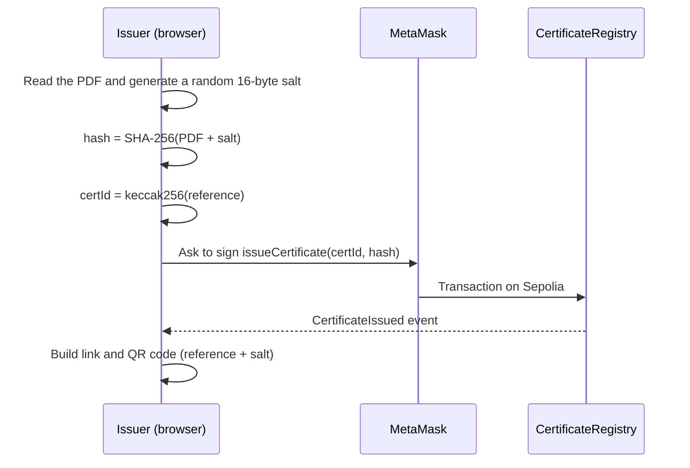
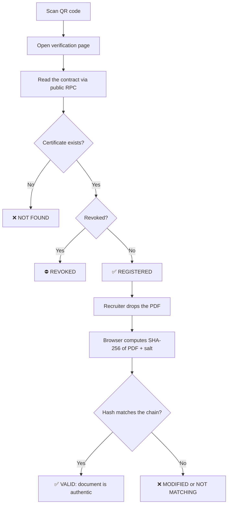
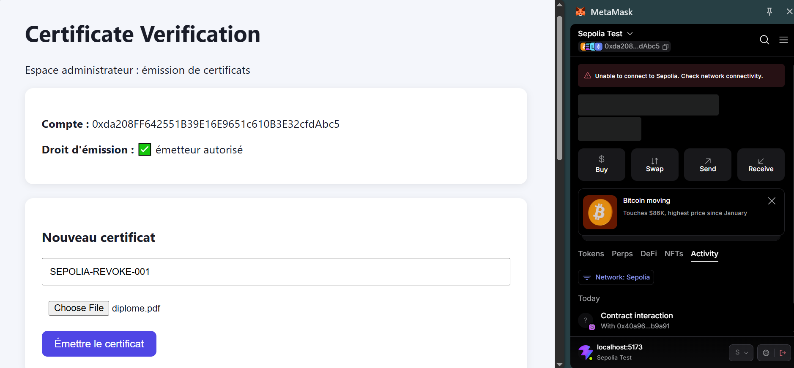
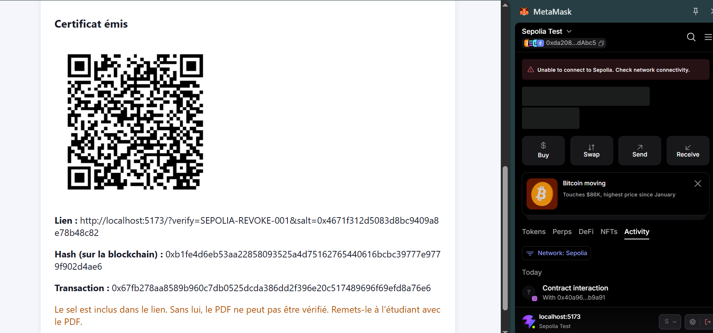
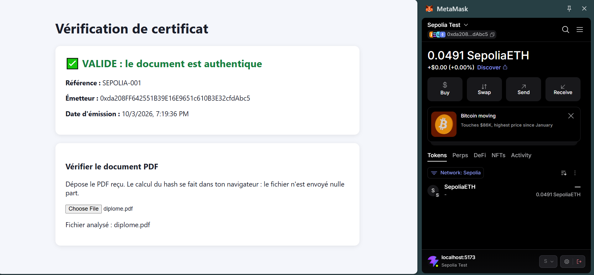
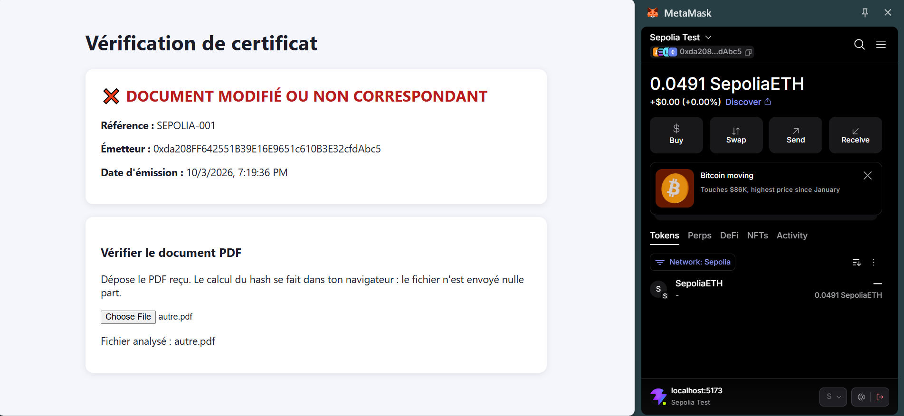
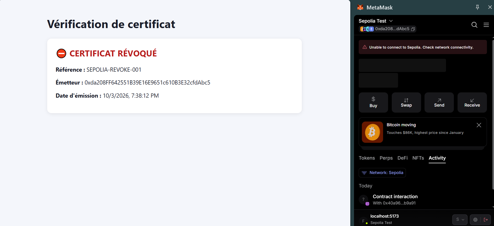
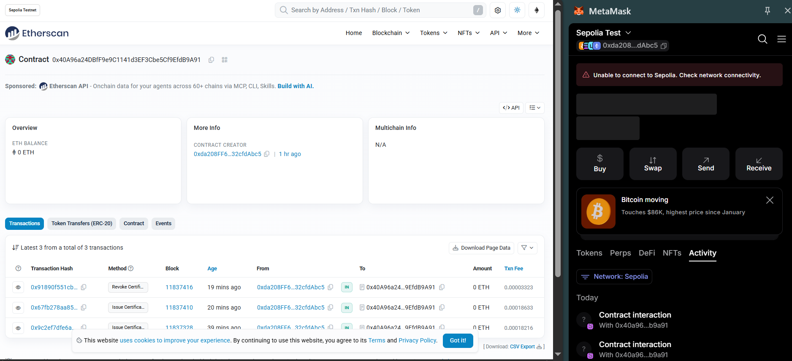
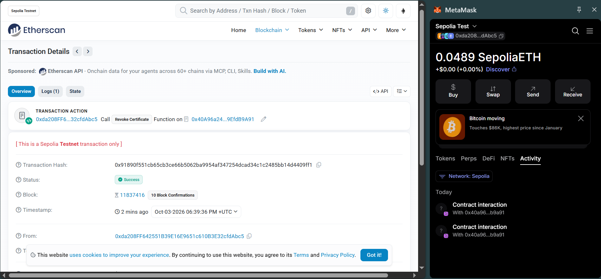
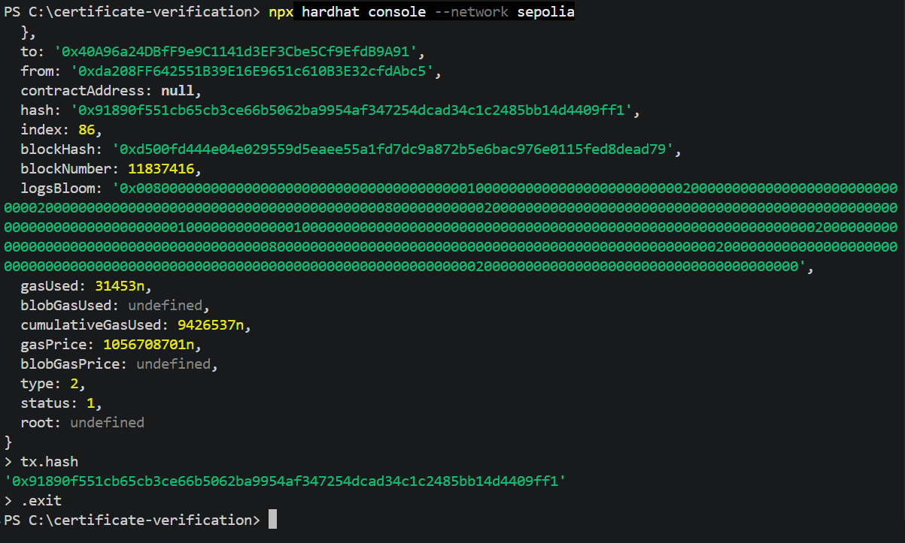

<h1 align="center">🎓 Decentralized Academic Certificate Verification</h1>

<p align="center">
  Tamper-proof diplomas on the blockchain, verified in seconds, without exposing personal data.
</p>

<p align="center">
  
  
  
  
  
  
  
</p>

<p align="center">
  <a href="https://sepolia.etherscan.io/address/0x40A96a24DBfF9e9C1141d3EF3Cbe5Cf9EfdB9A91"><b>🔗 View the contract on Etherscan (Sepolia)</b></a>
</p>

---

## 📑 Table of contents

1. [Why this project](#-why-this-project)
2. [How it works](#-how-it-works)
3. [Privacy by design](#-privacy-by-design)
4. [Architecture](#-architecture)
5. [Smart contract](#-smart-contract)
6. [Demo and screenshots](#-demo-and-screenshots)
7. [Tech stack](#-tech-stack)
8. [Project structure](#-project-structure)
9. [Run locally](#-run-locally)
10. [Deploy to Sepolia](#-deploy-to-sepolia)
11. [Security notes](#-security-notes)
12. [Limitations and roadmap](#-limitations-and-roadmap)

---

## 🎯 Why this project

Diplomas and certificates are easy to forge, and an employer usually has no quick, trustworthy way to check one. Calling the university is slow, and a PDF alone proves nothing.

This platform lets an institution register a **cryptographic fingerprint** of each certificate on a public blockchain. Anyone can then check a document against that fingerprint. If a single byte of the PDF changes, the verification fails.

**Who uses it**

| Role | What they do |
|---|---|
| 🏫 **Issuer** (university admin) | Connects with MetaMask, uploads the PDF, registers the certificate, hands the QR code to the student |
| 🎓 **Student** | Shares the QR code and the PDF with employers |
| 🏢 **Recruiter** | Scans the QR code, reads the blockchain, drops the PDF to confirm it is authentic. No wallet needed |

---

## ⚙️ How it works

### Issuing a certificate



### Verifying a certificate



### The four possible results

| Result | Meaning |
|---|---|
| ✅ **VALID** | The certificate exists, is not revoked, and the PDF matches the on-chain hash |
| ❌ **MODIFIED** | The certificate exists, but the PDF does not match (altered or wrong file) |
| ⛔ **REVOKED** | The issuer cancelled the certificate (error, fraud). The record stays on-chain for traceability |
| ❌ **NOT FOUND** | No certificate is registered under this reference |

---

## 🔒 Privacy by design

- **Nothing personal goes on-chain.** No name, grade or PDF: only a `bytes32` hash.
- **A random salt protects the hash.** Without it, someone could guess a hash by trying common names and dates. The salt travels in the QR link, not on the blockchain.
- **The PDF never leaves the browser.** Hashing runs client-side with ethers.js.
- **Verification is free and wallet-less.** It is a public `view` call.
- **The blockchain is immutable.** That is why only the hash is stored: anything written there stays forever.

---

## 🏗 Architecture

```
┌──────────────────────┐        ┌────────────┐        ┌──────────────────────────┐
│  React + Vite        │──────► │  MetaMask  │──────► │  CertificateRegistry.sol │
│  (Admin + Verify)    │        └────────────┘        │  Sepolia testnet         │
│                      │                              └────────────▲─────────────┘
│  ethers.js v6        │──── public RPC (read-only) ──────────────┘
└──────────────────────┘

PDF + salt ──► SHA-256 ──► hash ──► stored on-chain
```

- **Writes** (issue, revoke) go through MetaMask and cost a small amount of test ETH.
- **Reads** (verification) use a public RPC endpoint: no wallet, no cost, and no API key exposed in the frontend.

---

## 📜 Smart contract

`contracts/CertificateRegistry.sol`: Solidity `^0.8.24`, built on OpenZeppelin `Ownable`.

| Function | Access | Description |
|---|---|---|
| `setIssuer(address, bool)` | Owner | Authorize or remove an issuer |
| `issueCertificate(bytes32 certId, bytes32 hash)` | Issuer | Register a certificate. Duplicate IDs are rejected |
| `revokeCertificate(bytes32 certId)` | Issuer | Mark a certificate as revoked (never deleted) |
| `verifyCertificate(bytes32 certId, bytes32 hash)` | Public `view` | Returns `exists`, `revoked`, `hashMatches` |
| `getCertificate(bytes32 certId)` | Public `view` | Returns `issuer`, `issuedAt`, `revoked` |

**Design choices**

- **Role separation:** the owner manages issuers, and only issuers can issue or revoke.
- **Custom errors** (`NotIssuer`, `AlreadyExists`, `NotFound`, `AlreadyRevoked`) instead of revert strings, which are cheaper in gas and clearer.
- **Events** for every state change (`IssuerUpdated`, `CertificateIssued`, `CertificateRevoked`) so everything can be audited off-chain.
- **Compact storage:** a struct with `bytes32`, `address`, `uint64` timestamp and `bool`.

**Tests** (`test/CertificateRegistry.test.js`, run with `npx hardhat test`):

- ✔ an issuer can create a valid certificate
- ✔ a non-issuer is rejected
- ✔ a modified document is detected
- ✔ a duplicate certificate is rejected
- ✔ revocation works

---

## 📸 Demo and screenshots

### 1. Issuer dashboard

The issuer connects MetaMask. The app checks on-chain that the account is an authorized issuer.



After issuing, the app shows the QR code, the verification link, the stored hash and the transaction hash.



### 2. Verification page

| ✅ Valid | ❌ Modified | ⛔ Revoked |
|:---:|:---:|:---:|
|  |  |  |
| Original PDF dropped | A different PDF dropped | Certificate cancelled by the issuer |

### 3. On-chain proof (Sepolia)

The contract and its transactions are public and can be checked by anyone.


*Revocation transaction of `SEPOLIA-REVOKE-001`, visible on Sepolia:*



### 4. Automated tests



---

## 🧰 Tech stack

| Layer | Technology |
|---|---|
| Smart contract | Solidity 0.8, OpenZeppelin |
| Development and tests | Hardhat, Chai, ethers.js |
| Frontend | React, Vite |
| Web3 | ethers.js v6, MetaMask |
| QR codes | `qrcode` |
| Network | Ethereum Sepolia testnet |
| RPC | Alchemy (deployment), PublicNode (frontend reads) |
| Tooling | Git and GitHub |

---

## 📁 Project structure

```
certificate-verification/
├── contracts/
│   └── CertificateRegistry.sol     # Smart contract
├── test/
│   └── CertificateRegistry.test.js # 5 automated tests
├── scripts/
│   └── deploy.js                   # Deployment script
├── frontend/
│   └── src/
│       ├── App.jsx                 # Admin page + routing
│       ├── Verify.jsx              # Recruiter verification page
│       └── contract.js             # Address, chain, ABI, RPC
├── docs/screenshots/               # Images used in this README
├── hardhat.config.js
├── .env.example                    # Template, no secrets
└── README.md
```

---

## 🚀 Run locally

**Prerequisites:** Node.js 18+ (tested with 24), Git, and the MetaMask browser extension.

```bash
git clone https://github.com/YOUR-USERNAME/certificate-verification.git
cd certificate-verification
npm install
npx hardhat compile
npx hardhat test
```

### Option A: local blockchain

Open three terminals at the project root:

```bash
# Terminal 1: local blockchain
npx hardhat node

# Terminal 2: deploy the contract locally
npx hardhat run scripts/deploy.js --network localhost

# Terminal 3: frontend
cd frontend
npm install
npm run dev
```

Then set `CONTRACT_ADDRESS`, `CHAIN_ID = 31337` and `RPC_URL = "http://127.0.0.1:8545"` in `frontend/src/contract.js`, and add the **Hardhat Local** network in MetaMask (RPC `http://127.0.0.1:8545`, chain ID `31337`).

> The local chain resets every time you restart `npx hardhat node`: redeploy and reissue your certificates.

### Option B: Sepolia testnet

See the next section.

---

## 🌐 Deploy to Sepolia

1. Create a **new MetaMask account used only for testing** and get free Sepolia ETH from a faucet.
2. Create an Alchemy app on **Ethereum Sepolia** and copy its HTTPS URL.
3. Copy `.env.example` to `.env` and fill it in:

```
SEPOLIA_RPC_URL=https://eth-sepolia.g.alchemy.com/v2/YOUR_API_KEY
PRIVATE_KEY=0xYOUR_TEST_WALLET_PRIVATE_KEY
```

4. Deploy:

```bash
npx hardhat run scripts/deploy.js --network sepolia
```

5. Put the printed address in `frontend/src/contract.js`, set `CHAIN_ID = 11155111`, then run `npm run dev` inside `frontend/`.

Deployed instance: [`0x40A96a24DBfF9e9C1141d3EF3Cbe5Cf9EfdB9A91`](https://sepolia.etherscan.io/address/0x40A96a24DBfF9e9C1141d3EF3Cbe5Cf9EfdB9A91)

---

## 🛡 Security notes

- `.env` is git-ignored. **Never commit a private key or an RPC key.**
- Use a wallet created **only for testnet**, never one that holds real funds.
- The frontend only contains a **public** RPC URL. Private API keys must never be placed in frontend code, because every visitor can read it.
- Anyone holding a verification link can verify that specific certificate. The link contains the salt, so share it only with the people who should check the document.
- The certificate ID is derived from a human-readable reference, so someone who guesses a reference can learn whether it exists, its issuer and its issue date. They still cannot read the document without the PDF and the salt. For production, use unpredictable references.

---

## 🗺 Limitations and roadmap

**Current limitations**

- Testnet only. This is a portfolio project, not a production system.
- QR links currently point to the local development server.
- Revocation is done from the Hardhat console, there is no admin UI for it yet.
- A single owner controls the issuer list.

**Planned improvements**

- [ ] Host the frontend on Vercel so QR codes work from any phone
- [ ] Add a revocation button to the admin page
- [ ] Store optional metadata on IPFS
- [ ] Optional FastAPI backend (PDF generation, off-chain metadata)
- [ ] Multi-signature issuer governance
- [ ] Gas optimization and contract verification on Etherscan

---

## 👨‍💻 Auteur

**Fouad El-Ouafy**
🔗 [GitHub](https://github.com/FouadElOuafy)

---

## 📄 Licence

Ce projet est open source — [MIT License](LICENSE)